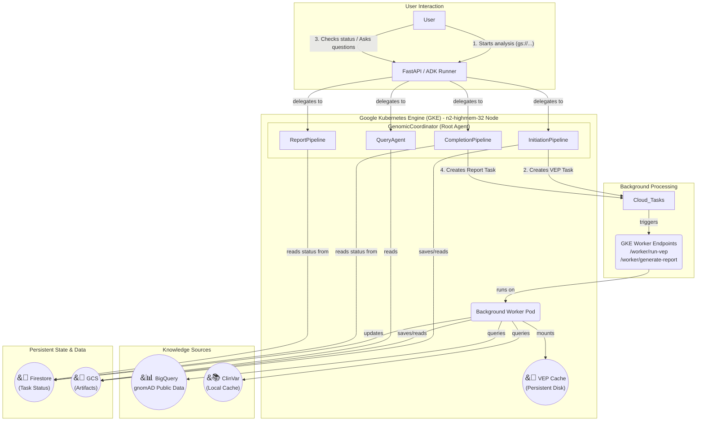

# Variant Analysis Multi-Agent System

This project implements a resilient and scalable multi-agent system using the Google Agent Development Kit (ADK) for dynamic and interactive genomic variant analysis. It is designed for production deployment on Google Kubernetes Engine (GKE) and is capable of processing large VCF files through a robust, multi-phase, conversational workflow with integrated population frequency analysis via gnomAD BigQuery.

## Project Goal

This project transforms a static, sequential variant analysis pipeline into a flexible, production-grade, multi-agent system. This system can perform a comprehensive, multi-hour analysis on large VCF files as a background task and then allow users to return later to conduct fast, interactive, conversational queries on the results, enriched with population frequency data from gnomAD.

## Architecture Overview

The system is architected as a set of coordinated microservices and agents, leveraging the strengths of both GKE for high-performance computing and Google Cloud's managed services for reliability and scalability.



1.  **GKE Service:** A FastAPI server running on a powerful GKE node serves as the main entry point. It hosts the ADK `Runner` and the root `GenomicCoordinator` agent.
2.  **`GenomicCoordinator` Agent:** A top-level `LlmAgent` that acts as an intelligent router. It understands user intent and delegates tasks to one of four specialized sub-pipelines.
3.  **`InitiationPipeline`:** A `SequentialAgent` that handles the quick, initial submission. It parses the VCF file and creates a background task in Cloud Tasks for VEP annotation.
4.  **Cloud Tasks & Background Workers:** Google Cloud Tasks manages long-running jobs:
    - VEP annotation (~1 hour)
    - Report generation with gnomAD/ClinVar queries (~3-5 minutes)
5.  **`CompletionPipeline`:** Checks VEP status and automatically triggers report generation when complete.
6.  **`ReportPipeline`:** Retrieves and presents the final clinical report with population frequencies.
7.  **`QueryAgent`:** A specialized `LlmAgent` that handles fast, conversational follow-up questions about the final results.
8.  **Knowledge Integration:**
    - **BigQuery gnomAD:** Queries population frequencies from public gnomAD datasets (v2 and v3)
    - **ClinVar:** Local cache for clinical significance annotations
9.  **Persistent Storage:**
    *   **Firestore:** Reliably tracks the status of long-running jobs
    *   **Google Cloud Storage (GCS):** Stores the large data artifacts (parsed variants, annotated variants, final findings) generated during the pipeline.
    *   **GCE Persistent Disk:** Provides fast, read-only access to the pre-downloaded VEP cache for high-performance annotation.

## Features

-   **Multi-Agent Architecture:** Uses robust `SequentialAgent` workflows controlled by a top-level coordinator for maximum reliability.
-   **Population Frequency Integration:** Queries gnomAD BigQuery for allele frequencies across multiple populations.
-   **Dual Reference Support:** Automatically queries both gnomAD v2 (GRCh37) and v3 (GRCh38) to handle reference mismatches.
-   **Long-Running Task Offloading:** Intelligently offloads the multi-hour VEP annotation process to a background worker managed by Google Cloud Tasks.
-   **Two-Phase Background Processing:** 
    - Phase 1: VEP annotation (~1 hour)
    - Phase 2: Knowledge retrieval + clinical assessment (~3-5 minutes)
-   **Non-Blocking Architecture:** All heavy operations run asynchronously or in background workers.
-   **Optimized Performance:** Leverages a high-performance GKE node (32 vCPU / 256 GB RAM) and a pre-populated Persistent Disk for the VEP cache, reducing VEP processing time from 6+ hours to ~1 hour.
-   **Intelligent Clinical Assessment:** Employs a sophisticated "map-reduce" pattern to analyze thousands of pathogenic variants, identify clinically significant patterns (like compound heterozygosity), and generate a high-quality summary.
-   **Population-Aware Risk Assessment:** Incorporates ancestry-specific frequencies for precision medicine.
-   **Conversational Querying:** After the analysis is complete, a dedicated `QueryAgent` allows for fast, interactive follow-up questions about specific genes.
-   **HTTPS Support:** Production-ready HTTPS endpoint with SSL/TLS termination for secure API access from web frontends.

## Analysis Capabilities

This system performs comprehensive whole-genome analysis with population context, not targeted gene panels:
- Analyzes ALL 7.8M+ variants in the VCF
- Identifies ~1,000-2,000 pathogenic variants across all genes
- Queries population frequencies for up to 10,000 variants from gnomAD
- Provides ancestry-specific allele frequencies (African, European, East Asian, Latino, etc.)
- Calculates carrier frequencies and homozygote counts
- Uses pattern detection to highlight clinically significant findings
- Allows targeted queries for specific genes of interest

## Performance Characteristics

- VCF Parsing: ~30 seconds for 7.8M variants
- VEP Annotation: ~60-70 minutes for 7.8M variants (background)
- Report Generation (background, non-blocking):
  - ClinVar annotations: ~2 minutes
  - gnomAD frequencies: ~30 seconds for 10K variants
  - Clinical assessment: ~2 minutes
  - Total: ~3-5 minutes
- Gene Query: <5 seconds per query
- BigQuery costs: ~$0.50 per full analysis (well within free tier)

## Prerequisites

-   Google Cloud SDK (`gcloud`)
-   `kubectl` command-line tool
-   Docker
-   Python 3.10+
-   A Google Cloud Project with the following APIs enabled:
    -   Kubernetes Engine API
    -   Artifact Registry API
    -   Cloud Build API
    -   Cloud Tasks API
    -   Firestore API
    -   BigQuery API (for gnomAD)
    -   IAM API
-   (Optional) A domain name for HTTPS access
-   (Optional) Google Cloud DNS or another DNS provider

## Setup and Deployment

### 1. Google Cloud Services Setup (One-Time)

a. **Create Firestore Database:**
```bash
gcloud firestore databases create --location=us-central1 --project=<YOUR_PROJECT_ID>
```

b. **Create Cloud Tasks Queue:**
```bash
gcloud tasks queues create background \
  --location=us-central1 \
  --project=<YOUR_PROJECT_ID>
```

c. **Create Artifact Registry Repository:**
```bash
gcloud artifacts repositories create prod \
  --repository-format=docker \
  --location=us-central1 \
  --project=<YOUR_PROJECT_ID>

# Configure Docker authentication
gcloud auth configure-docker us-central1-docker.pkg.dev
```

d. **Enable BigQuery API (for gnomAD):**
```bash
gcloud services enable bigquery.googleapis.com --project=<YOUR_PROJECT_ID>
```

### 2. GKE Infrastructure Setup

a. **Create GKE Cluster:**
```bash
gcloud container clusters create genomics-cluster \
  --zone=us-central1-a \
  --num-nodes=1 \
  --enable-autoscaling --min-nodes=0 --max-nodes=1 \
  --machine-type=n2-highmem-32 \
  --workload-pool=<YOUR_PROJECT_ID>.svc.id.goog \
  --addons GcsFuseCsiDriver \
  --project=<YOUR_PROJECT_ID>
```

b. **Get Cluster Credentials:**
```bash
gcloud container clusters get-credentials genomics-cluster \
  --zone=us-central1-a \
  --project=<YOUR_PROJECT_ID>
```

c. **Create Kubernetes Service Account:**
```bash
kubectl create serviceaccount genomics-agent-ksa

# Annotate for Workload Identity
kubectl annotate serviceaccount genomics-agent-ksa \
  iam.gke.io/gcp-service-account=firebase-adminsdk-fbsvc@<YOUR_PROJECT_ID>.iam.gserviceaccount.com
```

d. **Set Up Workload Identity Binding:**
```bash
gcloud iam service-accounts add-iam-policy-binding \
  firebase-adminsdk-fbsvc@<YOUR_PROJECT_ID>.iam.gserviceaccount.com \
  --role=roles/iam.workloadIdentityUser \
  --member="serviceAccount:<YOUR_PROJECT_ID>.svc.id.goog[default/genomics-agent-ksa]" \
  --project=<YOUR_PROJECT_ID>
```

e. **Grant Required IAM Permissions:**
```bash
# Firestore access
gcloud projects add-iam-policy-binding <YOUR_PROJECT_ID> \
  --member="serviceAccount:firebase-adminsdk-fbsvc@<YOUR_PROJECT_ID>.iam.gserviceaccount.com" \
  --role="roles/datastore.user"

# Cloud Tasks access
gcloud projects add-iam-policy-binding <YOUR_PROJECT_ID> \
  --member="serviceAccount:firebase-adminsdk-fbsvc@<YOUR_PROJECT_ID>.iam.gserviceaccount.com" \
  --role="roles/cloudtasks.enqueuer"

# GCS access
gcloud projects add-iam-policy-binding <YOUR_PROJECT_ID> \
  --member="serviceAccount:firebase-adminsdk-fbsvc@<YOUR_PROJECT_ID>.iam.gserviceaccount.com" \
  --role="roles/storage.objectViewer"

# BigQuery access (for gnomAD)
gcloud projects add-iam-policy-binding <YOUR_PROJECT_ID> \
  --member="serviceAccount:firebase-adminsdk-fbsvc@<YOUR_PROJECT_ID>.iam.gserviceaccount.com" \
  --role="roles/bigquery.jobUser"

# BigQuery data viewer for public datasets
gcloud projects add-iam-policy-binding <YOUR_PROJECT_ID> \
  --member="serviceAccount:firebase-adminsdk-fbsvc@<YOUR_PROJECT_ID>.iam.gserviceaccount.com" \
  --role="roles/bigquery.dataViewer"
```

### 3. VEP Cache Setup (one-time)

a. **Download VEP Cache and Upload to GCS (Run on a local machine or a temporary VM)**

This step downloads approximately 100GB of data and should only be performed once. The VEP cache data will be stored in your own GCS bucket.

```bash
# Create a GCS bucket to store the VEP cache permanently
gcloud storage buckets create gs://<YOUR_PROJECT_ID>_vep-cache-bucket --project=<YOUR_PROJECT_ID> --location=US-CENTRAL1

# Create a local directory for the download
mkdir -p ~/vep_cache_data
cd ~/vep_cache_data

# Download the VEP cache for GRCh38 (this is a ~100GB file and will take time)
wget https://ftp.ensembl.org/pub/release-113/variation/indexed_vep_cache/homo_sapiens_vep_113_GRCh38.tar.gz

# Extract the cache
tar -xzvf homo_sapiens_vep_113_GRCh38.tar.gz

# Upload the extracted 'homo_sapiens' directory to your GCS bucket
# This will also take a significant amount of time
gsutil -m cp -r homo_sapiens gs://<YOUR_PROJECT_ID>_vep-cache-bucket/
```

b. **Create and Populate Persistent Disk for VEP Cache:**

This step copies the data from your GCS bucket onto a GCE Persistent Disk, which provides much faster I/O for the VEP tool running in your GKE cluster.

```bash
# Create the disk
gcloud compute disks create vep-cache-disk --size=100GB --zone=us-central1-a --project=<YOUR_PROJECT_ID>

# Create a temporary VM to load the cache data
gcloud compute instances create cache-loader --zone=us-central1-a --disk=name=vep-cache-disk,mode=rw --project=<YOUR_PROJECT_ID>

# SSH into the VM and run the following commands inside it
gcloud compute ssh cache-loader --zone=us-central1-a

# --- Inside the VM ---
sudo mkfs.ext4 /dev/sdb
sudo mkdir -p /mnt/cache/homo_sapiens
sudo mount /dev/sdb /mnt/cache
sudo chmod 777 /mnt/cache/homo_sapiens
gsutil -m cp -r gs://<YOUR_PROJECT_ID>_vep-cache-bucket/homo_sapiens/113_GRCh38 /mnt/cache/homo_sapiens/
exit
# --- End of VM commands ---

# Delete the temporary VM (the disk and its data will remain)
gcloud compute instances delete cache-loader --zone=us-central1-a --quiet
```

### 4. Application Setup

a. **Clone Repository & Install Dependencies:**
```bash
git clone <your-repo-url>
cd backend
python3 -m venv .venv
source .venv/bin/activate
pip install -r requirements.txt
```

b. **Update Dependencies (`requirements.txt`):**
Ensure these are included:
```
google-cloud-bigquery==3.11.4
google-cloud-firestore==2.11.1
google-cloud-tasks==2.13.1
```

c. **Configure Environment (`.env` file):**
Create a `.env` file in the root of the project and add:
```
GEMINI_API_KEY="AIzaSy..."
GOOGLE_CLOUD_PROJECT="<YOUR_PROJECT_ID>"
```

d. **Authenticate `gcloud`:**
```bash
gcloud auth application-default login
```

### 5. Build and Deploy

a. **Build and Push the Docker Image:**
```bash
gcloud builds submit --tag us-central1-docker.pkg.dev/<YOUR_PROJECT_ID>/prod/genomics-agent:latest --project=<YOUR_PROJECT_ID>
```

b. **Create Kubernetes Secret:**
```bash
kubectl create secret generic gemini-api-key-secret --from-literal=key='<YOUR_GEMINI_API_KEY>'
```

c. **Deploy to GKE:**
- Edit `gke/genomics-deployment.yaml` to:
  - Use your image tag
  - Set correct environment variables (PROJECT_ID, QUEUE_NAME, etc.)
- Apply the Kubernetes configurations:
```bash
kubectl apply -f gke/genomics-deployment.yaml
```

d. **Get the External IP and Update the Worker URL:**
```bash
# This may take a few minutes
kubectl get service genomics-agent-service

# Once you have the EXTERNAL-IP, update the running deployment
kubectl set env deployment/genomics-agent WORKER_URL=http://<YOUR_EXTERNAL_IP>/worker/run-vep
```

e. **Force a Pod Restart** to apply the new environment variable:
```bash
kubectl rollout restart deployment/genomics-agent
# (You may need to manually delete the old pod to resolve the persistent disk deadlock)
```

## HTTPS Load Balancer Setup (Production)

Modern web applications require HTTPS for security and to avoid mixed-content issues when your frontend is served over HTTPS. The default Kubernetes LoadBalancer service only provides HTTP access, so you'll need to set up a Google Cloud HTTPS Load Balancer for production use.

### Option 1: Google Cloud HTTPS Load Balancer (Recommended for Production)

This option provides a production-ready HTTPS endpoint with your own domain.

#### Prerequisites
- A domain name (e.g., `api.yourdomain.com`)
- Access to your domain's DNS settings

#### Step 1: Reserve a Static IP Address
```bash
# Reserve a global static IP
gcloud compute addresses create genomics-api-ip \
    --global \
    --project=<YOUR_PROJECT_ID>

# Get the IP address
gcloud compute addresses describe genomics-api-ip --global --format="value(address)"
```

#### Step 2: Configure DNS
Add an A record in your domain's DNS settings:
- Name: `api` (or your preferred subdomain)
- Type: `A`
- Value: The static IP address from Step 1
- TTL: 300 (or your preference)

Wait for DNS propagation (5-30 minutes typically).

#### Step 3: Create SSL Certificate
```bash
# Create a managed SSL certificate (Google will handle renewal)
gcloud compute ssl-certificates create genomics-api-cert \
    --domains=api.yourdomain.com \
    --global \
    --project=<YOUR_PROJECT_ID>
```

#### Step 4: Get Required Information
```bash
# Get the NodePort for your service
kubectl get service genomics-agent-service
# Note the port number after the colon (e.g., 80:31799/TCP → 31799 is the NodePort)

# Get the instance group name
gcloud compute instance-groups list --zones=us-central1-a
# Look for the group name like: gke-genomics-cluster-default-pool-XXXXX-grp
```

#### Step 5: Create Firewall Rule for Health Checks
```bash
# Allow Google Cloud health checkers to reach the NodePort
gcloud compute firewall-rules create allow-gke-health-checks \
    --allow tcp:<YOUR_NODEPORT> \
    --source-ranges 130.211.0.0/22,35.191.0.0/16 \
    --network default \
    --description "Allow Google Cloud health checks to NodePort"
```

#### Step 6: Create Health Check
```bash
gcloud compute health-checks create http genomics-api-health-check \
    --port=<YOUR_NODEPORT> \
    --request-path="/health" \
    --check-interval=10s \
    --timeout=5s \
    --unhealthy-threshold=3 \
    --healthy-threshold=2 \
    --global
```

#### Step 7: Create Backend Service
```bash
# Create the backend service
gcloud compute backend-services create genomics-gke-backend-service \
    --protocol=HTTP \
    --health-checks=genomics-api-health-check \
    --global

# Add the instance group as a backend
gcloud compute backend-services add-backend genomics-gke-backend-service \
    --instance-group=<YOUR_INSTANCE_GROUP_NAME> \
    --instance-group-zone=us-central1-a \
    --balancing-mode=UTILIZATION \
    --max-utilization=0.8 \
    --global
```

#### Step 8: Create URL Map
```bash
gcloud compute url-maps create genomics-api-url-map \
    --default-service=genomics-gke-backend-service
```

#### Step 9: Create HTTPS Proxy
```bash
gcloud compute target-https-proxies create genomics-api-https-proxy \
    --url-map=genomics-api-url-map \
    --ssl-certificates=genomics-api-cert \
    --global
```

#### Step 10: Create Forwarding Rule
```bash
gcloud compute forwarding-rules create genomics-api-https-rule \
    --address=genomics-api-ip \
    --target-https-proxy=genomics-api-https-proxy \
    --ports=443 \
    --global
```

#### Step 11: Verify Setup
```bash
# Check backend health (may take 2-3 minutes to become healthy)
gcloud compute backend-services get-health genomics-gke-backend-service --global

# Test the HTTPS endpoint
curl https://api.yourdomain.com/health

# Test the API
curl -X POST https://api.yourdomain.com/run \
  -H "Content-Type: application/json" \
  -H "Authorization: Bearer YOUR_FIREBASE_TOKEN" \
  -d '{"input_text": "Test message"}'
```

### Option 2: Ngrok (Quick Development/Testing)

For rapid development and testing without setting up a full load balancer, ngrok provides a quick HTTPS tunnel to your service.

#### Setup Ngrok
1. **Install ngrok:**
```bash
# macOS
brew install ngrok

# Linux
snap install ngrok

# Or download from https://ngrok.com/download
```

2. **Create free ngrok account** at https://ngrok.com and get your auth token

3. **Authenticate ngrok:**
```bash
ngrok config add-authtoken YOUR_AUTH_TOKEN
```

4. **Create tunnel to your Kubernetes LoadBalancer:**
```bash
# Get your LoadBalancer external IP
kubectl get service genomics-agent-service
# Note the EXTERNAL-IP

# Create HTTPS tunnel
ngrok http http://<YOUR_EXTERNAL_IP>
```

5. **Use the ngrok URL:**
Ngrok will provide a URL like `https://abc123.ngrok.io` that you can use immediately for testing.

**Ngrok Advantages:**
- Instant HTTPS endpoint
- No DNS configuration needed
- Great for development and demos
- Includes request inspection

**Ngrok Limitations:**
- URL changes on each restart (unless using paid plan)
- Rate limits on free tier
- Not suitable for production
- Adds latency

### Troubleshooting HTTPS Setup

**Backend shows unhealthy:**
```bash
# Check if NodePort is accessible
curl http://<NODE_EXTERNAL_IP>:<NODEPORT>/health

# Check firewall rules
gcloud compute firewall-rules list | grep <NODEPORT>

# Check health check configuration
gcloud compute health-checks describe genomics-api-health-check
```

**SSL certificate not provisioning:**
- Ensure DNS is properly configured and propagated
- Certificate provisioning can take up to 60 minutes
- Check certificate status:
```bash
gcloud compute ssl-certificates describe genomics-api-cert --global
```

**Mixed content errors in browser:**
- Ensure all API calls use HTTPS
- Update frontend to use `https://api.yourdomain.com` instead of HTTP endpoints
- Check browser console for specific mixed content warnings

## Population Frequency Analysis (gnomAD Integration)

The system now includes comprehensive population frequency analysis via BigQuery:

### Features
- **Dual Database Support:** Queries both gnomAD v2 (GRCh37) and v3 (GRCh38) to handle reference genome differences
- **Population Stratification:** Returns frequencies for:
  - African (AFR)
  - Latino/Admixed American (AMR)
  - East Asian (EAS)
  - European Non-Finnish (NFE)
  - Finnish (FIN)
  - Ashkenazi Jewish (ASJ)
  - South Asian (SAS)
  - Other populations (OTH)
- **Clinical Metrics:** Provides allele counts, allele numbers, and homozygote counts
- **Cost-Optimized:** Limits queries to 10,000 variants per analysis (~$0.50 per run)

### Example gnomAD Output
For a pathogenic APOB variant:
```json
{
  "variant": "2:21006087:C>T",
  "source": "gnomAD_v2",
  "global_af": 0.000064,
  "carrier_frequency": "1 in 15,686",
  "population_frequencies": {
    "african": 0.0,
    "european_non_finnish": 0.000065,
    "east_asian": 0.0,
    "latino": 0.0
  },
  "homozygotes": 0,
  "clinical_interpretation": "European-specific, very rare, high penetrance suspected"
}
```

## How to Use (User Journey)

### Phase 1: Start Analysis

1.  **Get a unique session ID:**
    ```bash
    SESSION_ID="my-analysis-$(date +%s)"
    echo "Using Session ID: $SESSION_ID"
    ```

2.  **Get Firebase Auth Token:**
    ```bash
    # You'll need to obtain a Firebase ID token from your authenticated user
    # This typically comes from your frontend application
    FIREBASE_TOKEN="your-firebase-id-token"
    ```

3.  **Send the VCF path:**
    ```bash
    # For HTTPS (production)
    curl -X POST https://api.yourdomain.com/run \
      -H "Content-Type: application/json" \
      -H "Authorization: Bearer $FIREBASE_TOKEN" \
      -d '{
        "session_id": "'$SESSION_ID'",
        "input_text": "Please analyze gs://brain-genomics/awcarroll/vcf_agent/HG002.novaseq.pcr-free.30x.deepvariant-v1.0.grch38.pathogenic.sort.vcf.gz"
      }'
    
    # For HTTP (development only)
    curl -X POST http://<YOUR_GKE_IP>/run \
      -H "Content-Type: application/json" \
      -H "Authorization: Bearer $FIREBASE_TOKEN" \
      -d '{
        "session_id": "'$SESSION_ID'",
        "input_text": "Please analyze gs://brain-genomics/awcarroll/vcf_agent/HG002.novaseq.pcr-free.30x.deepvariant-v1.0.grch38.pathogenic.sort.vcf.gz"
      }'
    ```

4.  **Receive the Task ID** from the immediate response.

### Phase 2: Wait and Get Results

1.  **Wait** for the VEP process to complete (~60-70 minutes). Monitor logs if desired.

2.  **Check status and trigger report generation:**
    ```bash
    curl -X POST https://api.yourdomain.com/run \
      -H "Content-Type: application/json" \
      -H "Authorization: Bearer $FIREBASE_TOKEN" \
      -d '{
        "session_id": "'$SESSION_ID'",
        "input_text": "Is my VEP analysis complete?"
      }'
    ```
    
    The system will automatically start report generation (3-5 minutes) if VEP is complete.

3.  **Get the final report:**
    ```bash
    curl -X POST https://api.yourdomain.com/run \
      -H "Content-Type: application/json" \
      -H "Authorization: Bearer $FIREBASE_TOKEN" \
      -d '{
        "session_id": "'$SESSION_ID'",
        "input_text": "Is my report ready? Please provide the clinical assessment."
      }'
    ```

### Phase 3: Conversational Querying

1.  After receiving the main report, ask specific follow-up questions:
    ```bash
    curl -X POST https://api.yourdomain.com/run \
      -H "Content-Type: application/json" \
      -H "Authorization: Bearer $FIREBASE_TOKEN" \
      -d '{
        "session_id": "'$SESSION_ID'",
        "input_text": "Were any pathogenic variants found in the APOB gene?"
      }'
    ```

2.  Receive a fast, detailed answer in seconds.

## Example Enhanced Output

The system now provides population-aware analysis:

```
Clinical Summary:
- Identified 1,166 pathogenic variants across 824 genes
- European-specific risk variants detected in APOB (1:15,686 carriers)
- Lynch syndrome variants (MSH2, EPCAM) require cascade screening
- Population screening recommended for common variants (AF > 1%)
- Family testing indicated for rare variants (AF < 0.01%)

Key Population Insights:
- 23 variants show population-specific patterns
- 5 variants absent in gnomAD suggest de novo mutations
- No homozygotes observed for 15 dominant variants (possible lethality)
```

## Common Issues

- **Pod stuck in Pending**: Check if previous pod still holds PersistentDisk lock
- **VEP fails**: Verify cache disk is properly mounted at `/mnt/cache`
- **Connection reset**: Assessment may timeout for very large datasets
- **Permission denied**: Ensure all IAM bindings are correctly configured
- **Cloud Tasks not triggering**: Verify queue name and location match your configuration
- **CORS errors**: Ensure your frontend domain is in the CORS allowed origins in `main.py`
- **Mixed content blocked**: Frontend must use HTTPS API endpoint, not HTTP
- **Health check failing**: Verify NodePort is correct and firewall rule exists
- **BigQuery permission denied**: Ensure BigQuery API is enabled and IAM roles are granted
- **gnomAD queries timeout**: Check if BigQuery client is initialized properly
- **Reference mismatch**: System automatically tries both v2 and v3 databases
- **Query costs excessive**: Limited to 10,000 variants per analysis by default

## Security Considerations

- **Authentication**: All API endpoints require Firebase authentication
- **HTTPS**: Production deployments should always use HTTPS to protect data in transit
- **CORS**: Configure allowed origins appropriately in `main.py`
- **Firewall Rules**: Only open necessary ports; health check rules should restrict source IPs
- **Secrets Management**: Use Kubernetes secrets for API keys, never commit them to repository

## Cost Management

**This deployment uses powerful and expensive compute resources.** To avoid unnecessary costs:

### Daily Cost Estimates (approximate):
- GKE n2-highmem-32 node: ~$20-30/day when running
- BigQuery (gnomAD queries): ~$0.50 per full analysis
- HTTPS Load Balancer: ~$0.50/day
- Persistent Disk (100GB): ~$0.17/day
- Firestore & Cloud Tasks: Usage-based, typically minimal
- **First 1TB of BigQuery queries per month are FREE**

### Cost Optimization:

```bash
# Scale down to 0 pods when not in use (stops billing for the GKE node)
kubectl scale deployment genomics-agent --replicas=0

# Scale back up to 1 pod when needed
kubectl scale deployment genomics-agent --replicas=1

# Delete the HTTPS load balancer if not needed long-term
# (Can be recreated following the setup steps)
gcloud compute forwarding-rules delete genomics-api-https-rule --global --quiet
gcloud compute target-https-proxies delete genomics-api-https-proxy --global --quiet
gcloud compute url-maps delete genomics-api-url-map --quiet
gcloud compute backend-services delete genomics-gke-backend-service --global --quiet
gcloud compute health-checks delete genomics-api-health-check --quiet

# Keep the static IP reserved (minimal cost) for easy recreation
# gcloud compute addresses delete genomics-api-ip --global --quiet  # Only if you don't need it
```

## Development vs Production

### Development Setup
- Use HTTP with Kubernetes LoadBalancer service
- Or use ngrok for quick HTTPS testing
- Single replica
- Permissive CORS settings

### Production Setup
- Use HTTPS Load Balancer with custom domain
- SSL certificate management
- Appropriate CORS restrictions
- Health checks and monitoring
- Consider adding Cloud Armor for DDoS protection
- Add Cloud CDN for static content caching

## Monitoring and Debugging

```bash
# View pod logs
kubectl logs -f deployment/genomics-agent

# Check load balancer logs
gcloud logging read "resource.type=http_load_balancer" --limit=20 --format=json

# Monitor backend health
watch gcloud compute backend-services get-health genomics-gke-backend-service --global

# Check SSL certificate status
gcloud compute ssl-certificates describe genomics-api-cert --global

# Test health endpoint
curl -v https://api.yourdomain.com/health

# Monitor BigQuery usage
gcloud logging read "resource.type=bigquery_project" --limit=20 --format=json

# Check BigQuery job history
bq ls -j -a -n 20

# Test gnomAD integration
kubectl exec -it deployment/genomics-agent -- python -c "
from services.gnomad_client import GnomADClient
import asyncio
client = GnomADClient()
# Test query would go here
"
```

## Architecture Benefits

The gnomAD BigQuery integration provides several advantages:
- **No local storage**: Eliminates 16GB local gnomAD database
- **Always current**: Uses latest gnomAD releases maintained by Broad Institute
- **Scalable**: Can query millions of variants efficiently
- **Cost-effective**: Leverages Google's free tier (1TB/month)
- **Non-blocking**: Async queries prevent UI freezing
- **Comprehensive**: Access to all populations and subpopulations
- 